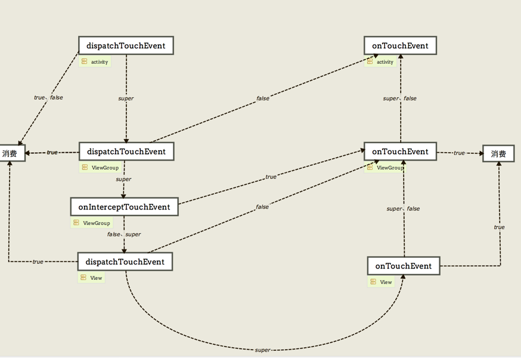

## 常识

---
- 抽象类是使用abstract修饰符修饰的类，接口是抽象方法的集合。抽象类可以有默认的方法实现，而接口不存在方法的实现。抽象类可以有构造器，而接口不能有构造器。一个子类只能存在一个父类（继承），但是可以存在多个接口。接口中除了static、final变量，不能有其他变量。

- Android的生命周期主要有七个，按其创建到销毁主要有以下几个阶段：onCreate() -> onStart() -> onResume() -> onPause() -> onStop() -> onDetroy()。

- service两种启动方式：
  - startService启动：onCreate()方法也只会被调用一次，而onStartConmon()可能会被多次调用。调用stopService()的时候，onDestroy()就会被调用，从而销毁服务。
  - bindService启动：利于activity中操作service，在activity获取ServiceConnection对象，通过ServiceConnection来获取service中内部类的类对象，然后通过这个类对象就可以调用类中的方法。并且生命周期与绑定的act相关。

- java虚拟机基于栈。 基于栈的机器必须使用指令来载入和操作栈上数据，java虚拟机运行的是java字节码。dalvik虚拟机是基于寄存器的，Dalvik运行的是自定义的.dex字节码格式。

- android是消息驱动的

- android四大组建：activity、service、broadcast、contentprovider

- Thread类提供sleep方法，Object类提供wait方法，sleep方法没有释放锁，而wait方法释放了锁，使其他线程可以使用同步控制块或者方法。sleep不出让系统资源；wait是进入线程等待池等待，出让系统资源，其他线程可以占用CPU

- ANR：ActivityManagerService(简称AMS)和WindowManagerService(简称WMS)会检测App的响应时间，如果App在特定时间无法相应屏幕触摸或键盘输入时间，或者特定事件没有处理完毕，就会出现ANR。

- Serializable是Java方法，Parcelable是android的方法。Serializable 使用 I/O 读写存储在硬盘上，而 Parcelable 是直接在内存中读写。内存的读写速度通常大于 IO 读写，Serializable 会使用反射，序列化和反序列化过程需要大量 I/O 操作， Parcelable 自已实现封送和解封（marshalled &unmarshalled）操作不需要用反射，数据也存放在 Native 内存中，效率要快很多，Serializable更适合数据持久化方便保存。

- apk打包流程：
  - 通过aapt打包res资源文件，生成R.java、resources.arsc和res文件（二进制 & 非二进制如res/raw和pic保持原样）
  - 处理.aidl文件，生成对应的Java接口文件
  - 通过Java Compiler编译R.java、Java接口文件、Java源文件，生成.class文件
  - 通过dex命令，将.class文件和第三方库中的.class文件处理生成classes.dex
  - 通过apkbuilder工具，将aapt生成的resources.arsc和res文件、assets文件和classes.dex一起打包生成apk
  - 通过Jarsigner工具，对上面的apk进行debug或release签名
  - 通过zipalign工具，将签名后的apk进行对齐处理。

## view相关

---

### 绘制

 
DecorView是一个应用窗口的根容器，它本质上是一个FrameLayout。DecorView有唯一一个子View，它是一个垂直的LinearLayout，包含两个子元素，一个是TitleView（ActionBar的容器），另一个是ContentView（窗口内容的容器）。关于ContentView，它是一个FrameLayout（android.R.id.content)。每个Activity都与一个Window相关联，用户界面则由Window所承载。

View的绘制是由ViewRoot来负责的。每个应用程序窗口的decorView都有一个与之关联的ViewRoot对象，这种关联关系是由WindowManager来维护的。

View的整个绘制流程分为三个阶段：
- measure:测量View的大小，计算出控件树中的各个控件要显示其内容的话，需要多大尺寸；
- layout: 计算View的位置，递归地完成整个控件树的布局（layout）工作；
- draw: 绘制View

MeasureSpec是一个32位整数，由SpecMode和SpecSize两部分组成，其中，高2位为SpecMode，低30位为SpecSize。SpecMode为测量模式，SpecSize为相应测量模式下的测量尺寸。View（包括普通View和ViewGroup）的SpecMode由本View的LayoutParams结合父View的MeasureSpec生成。
SpecMode的取值可为以下三种：
- EXACTLY: 对子View提出了一个确切的建议尺寸（SpecSize）；
- AT_MOST: 子View的大小不得超过SpecSize；
- UNSPECIFIED: 对子View的尺寸不作限制，通常用于系统内部。

draw的流程分为：
- 绘制背景;
- 通过onDraw()绘制自身内容;
- 通过dispatchDraw()绘制子View;
- 绘制滚动条；

Layout的性能差距主要体现在measure过程，FrameLayout>LinearLayout>RelativeLayout。RelativeLayout会对子View做两次measure，LinearLayout的measure先判断线性规则，然后执行对应方向上的测量（LinearLayout 在有weight时，也会调用子View2次onMeasure）。

ViewStub 是一个不可见的，大小为0的视图，可以在运行过程中延时加载布局资源。当ViewStub被设置成可见，或者它的inflate() 方法被调用的时候，布局资源才会被填充，然后ViewStub本身就会被填充起来的布局资源替换掉。也就是说 ViewStub 被设置成可见或者它的inflate() 方法被调用之后，在视图树中就不存在了。被填充的布局在替换ViewStub的时候会使用ViewStub的布局参数（LayoutParameters）。而直接设置view的可见性，即便该view不可见，仍会被父窗体绘制，创建对象，被实例化，被设置属性。

### 事件

当用户触摸屏幕时（View 或 ViewGroup派生的控件），将产生点击事件（Touch事件），将点击事件（MotionEvent）传递到某个具体的View & 处理的过程。

事件传递的顺序：Activity -> ViewGroup -> View。

- dispatchTouchEvent(MotionEvent ev)：View/ViewGroup处理事件分发的发起者，View/ViewGroup接收到触控事件最先调起的就是这个方法，然后在该方法中判断是否处理拦截或是将事件分发给子容器
- onInterceptTouchEvent(MotionEvent ev)：ViewGroup专用，通过该方法可以达到控件事件的分发方向，一般可以在该方法中判断将事件给ViewGroup独吞或是它继续传递给子容器，是处理事件冲突的最佳地点
- onTouchEvent(MotionEvent event)：触控事件的真正处理者，最后每个事件都会在这里被处理

## Handler机制

- Message：消息，由MessageQueue统一队列，然后交由Handler处理。
- MessageQueue：消息队列，用来存放Handler发送过来的Message，并且按照先入先出的规则执行。
- Handler：处理者，负责发送和处理Message。
- Looper：消息轮询器，不断的从MessageQqueue中抽取Message并执行。

在创建Activity之前，当程序启动的时候，系统会先加载ActivityThread这个类，在这个类的main函数中，调用Looper.prepareMainLooper()初始化Looper对象并创建消息队列，然后调用Looper.loop()方法，不断的轮询消息队列中的消息。

post和postDelay的时序问题：
- Handler没有自己处理Delay，而是交给了MessageQueue处理，MessageQueue是一个单向链表
- postDelay()一个10秒钟的Runnable A、消息进队，MessageQueue调用nativePollOnce()阻塞，Looper阻塞；
- 紧接着post()一个Runnable B、消息进队，判断现在A时间还没到、正在阻塞，把B插入消息队列的头部（A的前面），然后调用nativeWake()方法唤醒线程；
- MessageQueue.next()方法被唤醒后，重新开始读取消息链表，第一个消息B无延时，直接返回给Looper；
- Looper处理完这个消息再次调用next()方法，MessageQueue继续读取消息链表，第二个消息A还没到时间，计算一下剩余时间（假如还剩9秒）继续调用nativePollOnce()阻塞；
- 直到阻塞时间到或者下一次有Message进队；

主线程的MessageQueue没有消息时，便阻塞在loop的queue.next()中的nativePollOnce()方法里，此时主线程会释放CPU资源进入休眠状态，直到下个消息到达或者有事务发生，通过往pipe管道写端写入数据来唤醒主线程工作。这里采用的epoll机制，是一种IO多路复用机制，可以同时监控多个描述符，当某个描述符就绪(读或写就绪)，则立刻通知相应程序进行读或写操作，本质同步I/O，即读写是阻塞的。 所以说，主线程大多数时候都是处于休眠状态，并不会消耗大量CPU资源。真正会卡死主线程的操作是在回调方法onCreate/onStart/onResume等操作时间过长，会导致掉帧，甚至发生ANR，looper.loop本身不会导致应用卡死。

## 线程、进程

### Volatile、synchronized、Atomic

Atomic原子操作类，在多线程并发操作同一个资源的情况下，使用Lock-Free算法来替代锁，这样开销小、速度快，对于原子操作类是采用原子操作指令实现的，从而可以保证操作的原子性。
原子性：比如一个操作i++；实际上这是三个原子操作，先把i的值读取、然后修改(+1)、最后写入给i。所以使用Atomic原子类操作数，比如：i++；那么它会在这步操作都完成情况下才允许其它线程再对它进行操作

Volatile可以看做是一个轻量级的synchronized，它可以在多线程并发的情况下保证变量的“可见性”，可见性就是在一个线程的工作内存中修改了该变量的值，该变量的值立即能回显到主内存中，从而保证所有的线程看到这个变量的值是一致的。由于不保证读写时序，还是可能造成脏数据。

synchronized叫做同步锁，只需要在一个方法或把需要同步的代码块包装在它内部，那么这段代码就是同步的了，所有线程对这块区域的代码访问必须先持有锁才能进入，否则则拦截在外面等待正在持有锁的线程处理完毕再获取锁进入，正因为它基于这种阻塞的策略，所以它的性能不太好，同意具有操作的原子性。

## JVM基础

### dalvik的heap&stack

- 栈区（stack），由编译器自动分配释放 ，存放函数的参数值，局部变量的值等。其操作方式类似于数据结构中的栈。
- 堆区（heap），一般由程序员分配释放， 若程序员不释放，JVM不定时观察发现没有引用指向时会GC回收 。所有线程共享的一块内存区域，在虚拟机启动时创建。此内存区域唯一的目的就是存放对象实例，几乎所有的对象都在这分配内存。
- 栈内存用来存储基本类型的变量和对象的引用变量，堆内存用来存储Java中的对象，无论是成员变量，局部变量，还是类变量，它们指向的对象都存储在堆内存中
- 栈内存归属于单个线程，每个线程都会有一个栈内存，其存储的变量只能在其所属线程中可见，即栈内存可以理解成线程的私有内存，堆内存中的对象对所有线程可见。堆内存中的对象可以被所有线程访问
- 如果栈内存没有可用的空间存储方法调用和局部变量，JVM会抛出java.lang.StackOverFlowError，如果是堆内存没有可用的空间存储生成的对象，JVM会抛出java.lang.OutOfMemoryError
- 栈的内存要远远小于堆内存，如果你使用递归的话，那么你的栈很快就会充满，-Xss选项设置栈内存的大小。-Xms选项可以设置堆的开始时的大小

### 垃圾回收

- 引用计数法：一个教科书式的判断对象存活的算法，简单来说是这样的：给对象增加一个引用计数器，每当有地方引用这个对象时，计数器加一，当引用失效时，计数器减一。这个算法实现简单，判定效率也高，但是，Java 虚拟机中并没有选这种算法来管理内存，原因是它很难解决对象之间循环引用的问题。
- 标记-清除算法 (Mark-Sweep)：算法如其名，先标记出需要回收的对象，然后一并回收被标记过的对象。效率不高，标记和清除两个过程的效率都不高，空间问题，标记清除之后会导致内存中出现大量的不连续的内存碎片，之后分配较大对象的内存空间时，导致没有足够的连续内存，可能会触发另一次的垃圾回收，这个问题也间接的反映出了效率不高。
- 复制算法：为了解决效率问题，复制算法出现了，它将可用内存容量划分为大小相等的两块，每次只用其中的一块。当这块内存用完了，就将还存活的对象复制到另一块上，然后清除已使用的那块。这样每次固定回收一半内存，实现简单，运行高效，并且不会出现内存碎片。
但是这个算法的代价也很大，就是要牺牲一半的内存。
- 分代收集算法：将堆分为新生代和老年代。新生代：对象存活率低，每次垃圾回收后都只有少量对象存活，所以此时用复制算法。老年代：对象存活率高，大量存活的对象，此时用标记-清除(标记-整理）算法。

### 引用方式

- 强引用（StrongReference）强引用是使用最普遍的引用。如果一个对象具有强引用，那垃圾回收器绝不会回收它。当内存空间不足，Java虚拟机宁愿抛出OutOfMemoryError错误，使程序异常终止，也不会靠随意回收具有强引用的对象来解决内存不足的问题
- 软引用（SoftReference）
如果内存空间不足了，就会回收这些对象的内存。只要垃圾回收器没有回收它，软引用可以和一个引用队列（ReferenceQueue）联合使用，如果软引用所引用的对象被垃圾回收器回收，Java虚拟机就会把这个软引用加入到与之关联的引用队列中
- 弱引用（WeakReference）
弱引用与软引用的区别在于：只具有弱引用的对象拥有更短暂的生命周期。在垃圾回收器线程扫描它所管辖的内存区域的过程中，一旦发现了只具有弱引用的对象，不管当前内存空间足够与否，都会回收它的内存。
弱引用可以和一个引用队列（ReferenceQueue）联合使用，如果弱引用所引用的对象被垃圾回收，Java虚拟机就会把这个弱引用加入到与之关联的引用队列中
- 虚引用（PhantomReference）
虚引用在任何时候都可能被垃圾回收器回收，主要用来跟踪对象被垃圾回收器回收的活动，被回收时会收到一个系统通知。虚引用与软引用和弱引用的一个区别在于：虚引用必须和引用队列 （ReferenceQueue）联合使用。当垃圾回收器准备回收一个对象时，如果发现它还有虚引用，就会在回收对象的内存之前，把这个虚引用加入到与之关联的引用队列中。

### Java类加载器

- 类加载器负责加载所有的类，同一个类(一个类用其全限定类名(包名加类名)标志)只会被加载一次
- Bootstrap ClassLoader:根类加载器，负责加载java的核心类，它不是java.lang.ClassLoader的子类，而是由JVM自身实现
- Extension ClassLoader:扩展类加载器，扩展类加载器的加载路径是JDK目录下jre/lib/ext,扩展类的getParent()方法返回null,实际上扩展类加载器的父类加载器是根加载器，只是根加载器并不是Java实现的
- System ClassLoader:系统(应用)类加载器，它负责在JVM启动时加载来自java命令的-classpath选项、java.class.path系统属性或CLASSPATH环境变量所指定的jar包和类路径。程序可以通过getSystemClassLoader()来获取系统类加载器。系统加载器的加载路径是程序运行的当前路径
- 自定义的ClassLoader
- 双亲委派模型的工作过程：
  - 首先会先查找当前ClassLoader是否加载过此类，有就返回；
  - 如果没有，查询父ClassLoader是否已经加载过此类，如果已经加载过,就直接返回Parent加载的类；
  - 如果整个类加载器体系上的ClassLoader都没有加载过，才由当前ClassLoader加载(调用findClass)，整个过程类似循环链表一样。
- 双亲委托机制的作用：
  - 共享功能：可以避免重复加载，当父亲已经加载了该类的时候，子类不需要再次加载，一些Framework层级的类一旦被顶层的ClassLoader加载过就缓存在内存里面，以后任何地方用到都不需要重新加载。
  - 隔离功能：因为String已经在启动时被加载，所以用户自定义类是无法加载一个自定义的类装载器，保证java/Android核心类库的纯净和安全，防止恶意加载。

### Activity启动流程

- ActivityManagerService(AMS)是Android中最核心的服务，主要负责系统中四大组件的启动、切换、调度及应用程序的管理和调度等工作。
- 热启动
  - 通知AMS来启动Activity
  - AMS收到启动消息后, 在进行一下校验, 同时调整Activity任务栈
  - AMS通知Activity A暂停, 调用其onPause方法;
  - AMS通知Activity B所在的进程去启动Activity, 如果进程不存在, 还在创建其进程(即Application)
  - ActivityThread创建Activity B 并启动
- 冷启动
  - 应用程序的开始可以说就是从ActivityThread.java中的main()方法开始的。
  - AMS请求创建进程
  - 初始化 Runtime
  - 注册进程到system_server
  - 创建application
  - 初始化主线程的Looper、主Handler。并使主线程进入等待接收Message消息的无限循环状态。

## 存储

### 数据库

- android数据库使用sqlite，轻量级CURD。
- SQLite数据库支持大部分SQL语法，允许使用SQL语句操作数据库，其本质是一个文件，不需要安装启动
- SQLite数据库打开只是一个文件的读写流
- 事务是一系列操作的集合，执行错误时，执行回滚。事务必须是原子工作单元；对于其数据修改，要么全都执行，要么全都不执行。事务在完成时，必须使所有的数据都保持一致状态。当不同的事务同时操纵相同的数据时，每个事务都有各自的完整数据空间。只要事务成功结束，它对数据库所做的更新就必须永久保存下来。
- 当并发事务同时访问一个资源时，有可能导致数据不一致，因此需要一种机制来将数据访问顺序化，以保证数据库数据的一致性。锁就是其中的一种机制。
- 锁机制
  - 未加锁：未和数据库建立连接、已建立连接但还没访问数据库、已用BEGIN开始了一个事务但未开始读写数据库，处于这些情形时是未加锁状态。
  - 共享锁：连接需要从数据库中读取数据时，需要申请获得一个共享锁，如果获取成功，则进入共享状态。
  - 预留锁：连接需要写数据至数据库时，首先申请一个预留锁，一个数据库同时只能有一个预留锁，预留锁可以与共享锁共存。获得预留锁后会进入预留状态，这时会先在缓存区中进行写操作，操作后的结果依然保存在缓存区中，未真正写入数据库。
  - 未决锁：连接从预留升级为排它前，需要先升级为未决锁，这时其他的连接就不能获取到共享锁了，但已经拥有共享锁的连接仍然正常读数据库，此时，拥有未决锁的连接等待其他拥有共享锁连接完成工作并释放其共享锁后，才能提升到排它锁。
  - 排它锁：连接需要提交修改时，需要将预留锁升级为排它锁，这时候其他链接都无法获取任何锁，直到当前连接的排它状态结束。